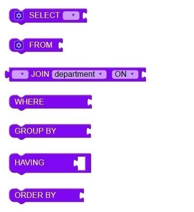
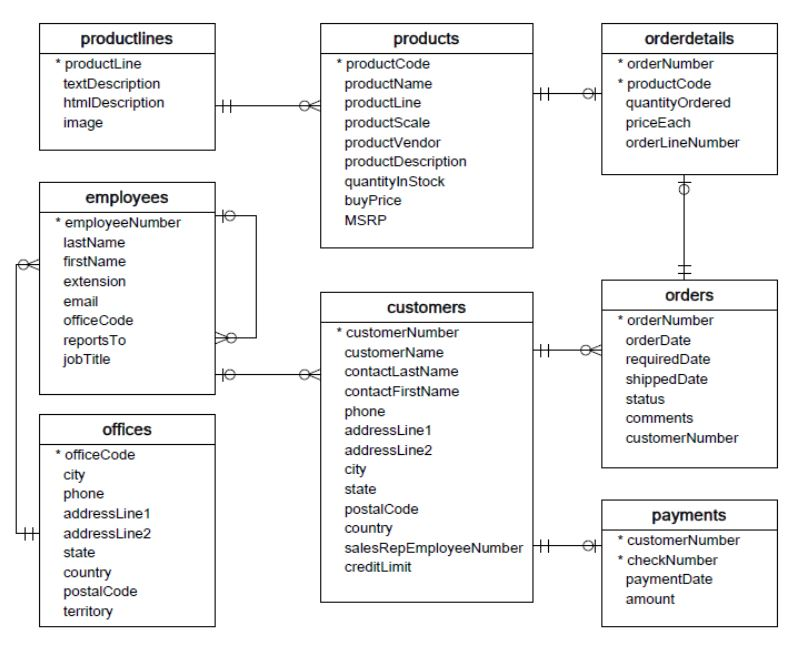

# BlocklySQL - a block-based editor for SQL
This is a block-based editor for SQL (on the basis of Google's blockly (https://github.com/google/blockly)). 


This first example uses the database ``weather` (by the project dbup2date) and returns the locations where more than five gale-force winds have been recorded. It equals the following SELECT-statement in SQL:

```
SELECT Wetterstation.Standort, Wettermessung.Max_Windgeschwindigkeit AS #Orkanböen
FROM Wetterstation 
JOIN Wettermessung ON Wetterstation.S_ID = Wettermessung.Standort_ID
WHERE Wettermessung.Max_Windgeschwindigkeit > 32.7
GROUP BY Wetterstation.Standort 
HAVING COUNT Wettermessung.Max_Windgeschwindigkeit > 5
ORDER BY Wettermessung.Max_Windgeschwindigkeit DESC;
```

## Elements

We have created several blocks to build queries with our editor. So far the following blocks have been created:

| BlocklySQL | Explanation |
| :-: | :-: |
|  | `Statements and clauses` |
|  | `Tables and attributes` |
|  | `(Logical) operators` |
|  | `(Mathematical) operators` |
|  | `Value inputs` |
|  | `Aggregate functions` |

## Demo & Example projects

### Classicmodels 

This sample database is from: http://www.mysqltutorial.org/mysql-sample-database.aspx. The `classicmodels` database is a retailer of scale models of classic cars database. It contains typical business data such as customers, products, sales orders, sales order line items, etc.



A demo of our editor using this database can be found here: https://go.uniwue.de/blocklysql. 

### Weather and Football 

In another example project we integrated our editor into the project "dbup2date" (https://dbup2date.uni-bayreuth.de/blocklysql/index.html) by the University of Bayreuth, Germany. This project provides daily updated databases (`football`, `weather`) to use in the classroom. 

## Installing

You are welcome to use our editor. You can either integrate it into your online project or run it on your local machine using the software suite XAMPP (https://www.apachefriends.org/de/index.html). 

## Contributing

In case you want to extend or adapt our editor go ahead and fork this repository. 

### Adding new blocks

New blocks can be added by creating `new_block.js` in the folder `sql/js/sql_blocks`. Additionally, for the new block to appear in the toolbox you have to import the file (using `<script></script>`) and add it to the toolbox in `index.html`.

The code of a block for our editor looks similiar to the code of the `AND` block:

Block definition:

```

```

Block function:

```

```
